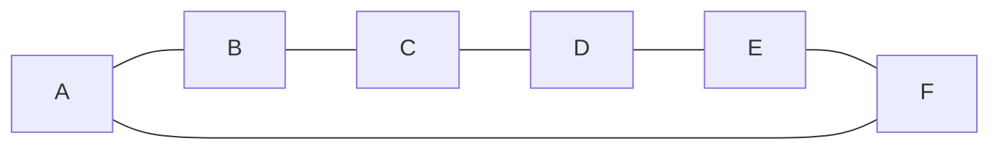
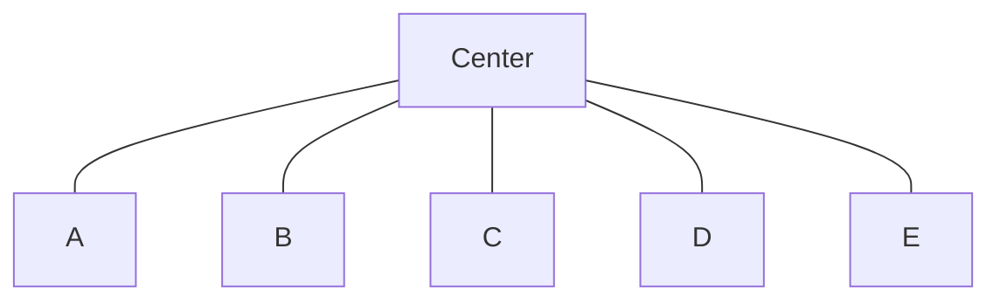
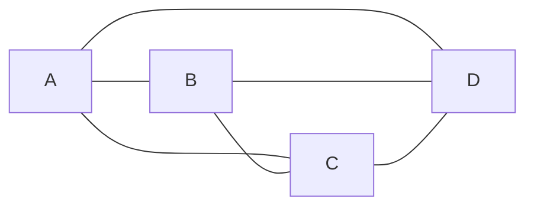
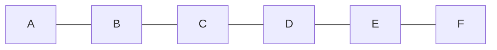
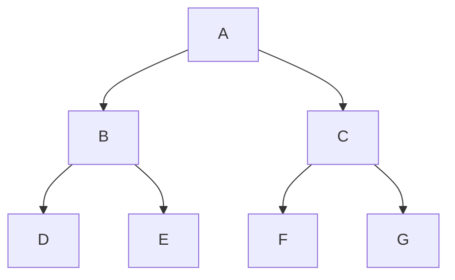
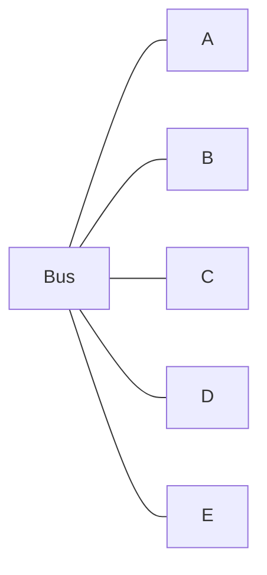

# Info
#### Architektura
 - peer-to-peer (P2P)
 - klient-server
#### Rozlehlosti sítí (Розмір мережі)
 - Osobní - Personal Area Network (PAN) (~ 1 m)
 - Místní - Local Area Network (LAN) (~ 100 m)
 - Městské - Metroolitan Area Network (MAN) (~ 10 km)
 - Roylehlé - Wide Area Network (WAN) (~ 1000 km)

## Základní síťové topologie
**Topologie** - způsob uspořádání linek mezi stanicemi (uzly) v síti.

#### Circle (Kruh)

#### Star (Hvězda)

#### Fully Connected (Plně propojená)

#### Line (Přímá)

#### Tree (Strom)

#### Bus (Sběrnice)

