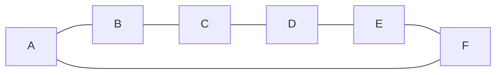
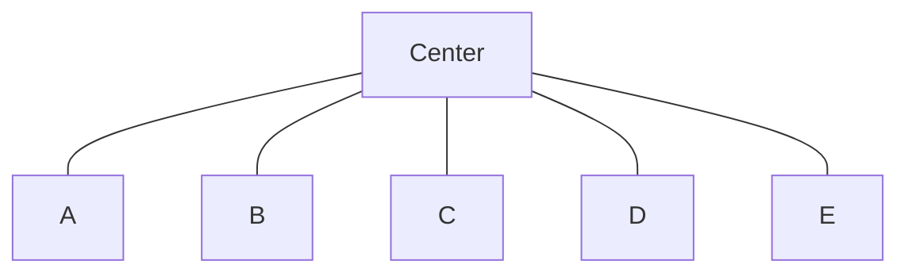
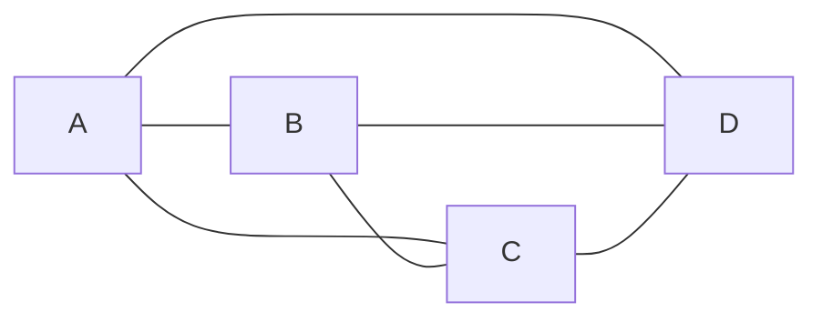
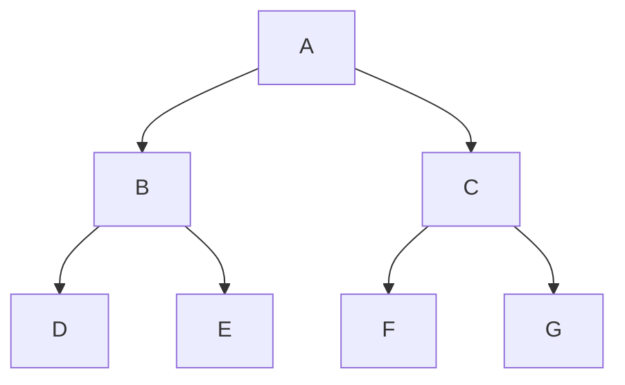
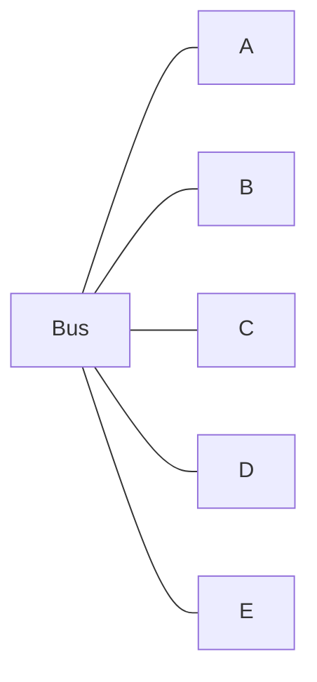
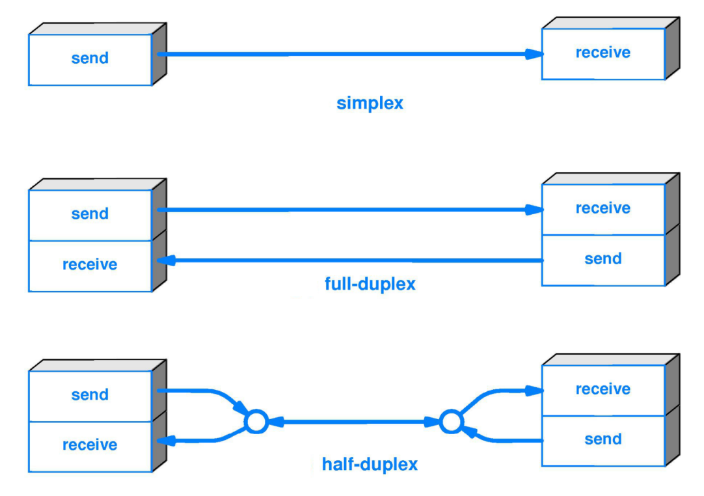
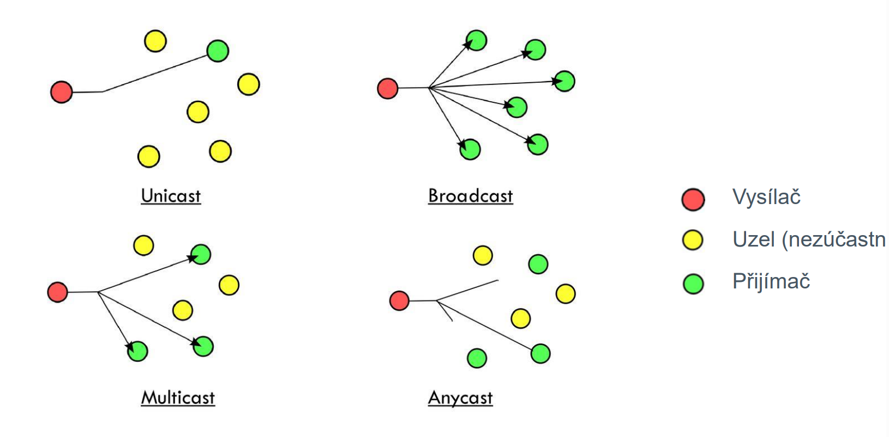
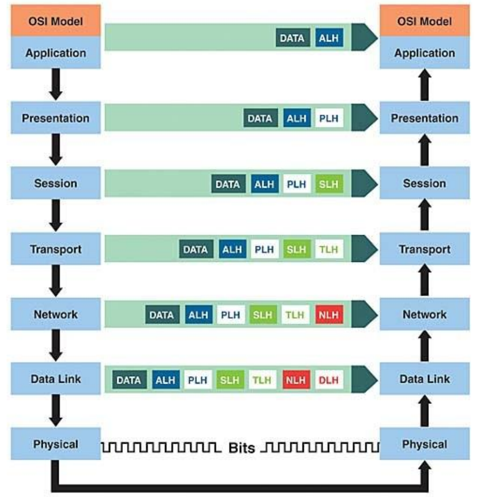
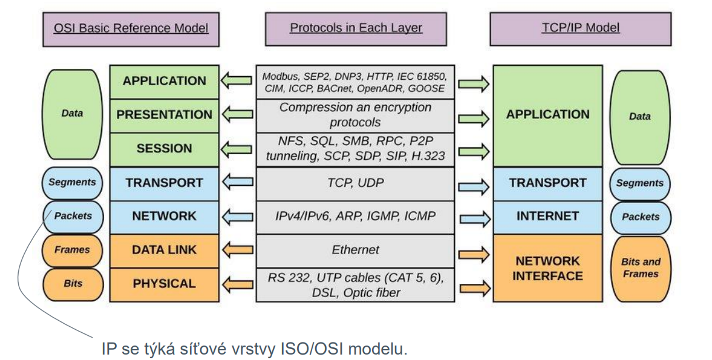

# Info
#### Architektura
 - peer-to-peer (P2P)
 - klient-server
#### Rozlehlosti sítí (Розмір мережі)
 - Osobní - Personal Area Network (PAN) (~ 1 m)
 - Místní - Local Area Network (LAN) (~ 100 m)
 - Městské - Metroolitan Area Network (MAN) (~ 10 km)
 - Roylehlé - Wide Area Network (WAN) (~ 1000 km)

## Základní síťové topologie
**Topologie** - způsob uspořádání linek mezi stanicemi (uzly) v síti.

#### Circle (Kruh)

#### Star (Hvězda)

#### Fully Connected (Plně propojená)

#### Line (Přímá)

#### Tree (Strom)

#### Bus (Sběrnice)

## Druhy linek v počítačových sítích dle možností vysílání a příjmu

## Základní druhy komunikačních operací v počítačových sítích

## Open System Interconnection (OSI) Model
|   Data   |                          Vrstva                        |          Příklad           |
|----------|--------------------------------------------------------|----------------------------|
|   Data   |            Aplicační (Síťový proces aplikací)          |            HTTP/FTP        |
|   Data   |        Prezentační (Prezentace dat a šifravání)        |            TLS/XML         |
|   Data   |           Relační (Komunikace mezi hostiteli)          |       RPC/NFS, NETBIOS     |
| Segmenty |   Transportní (End-to-End spojení a spolehlivost)      |            TCP/UDP         |
|  Pakety  |    Síťová (Určování cestz a IP) (logické adresování)   |          IP/Internet       |
|   Rámce  |         Linková (MAC a LLC) (Fyzické adresování)       |         Ethernet/LAN       |
|    Bity  |        Fyzická (Médium, signál, binárn přenos)         |  Optika, Metalika, Antény  |

Médium - prostředí, ve kterém se přenášejí data (kabel, vzduch, atd.)

## Enkapsulace a Dekapsulace posílaných dat

**A** - Application

**P** - Presentation

**S** - Session

**T** - Transport

**N** - Network

**D** - Data Link

**P** - Physical

**LG** - Layer Header

**PDU** - Protocol Data Unit

PDU = head + body

PDU7 = ALH + DATA

PDU6 = PLH + PDU7 = PLH + ALH + DATA

PDU5 = SLH + PDU6

## Komunikace mezi vrstvami
#### Učíme se česky
Router = směrovač, Switch = přepínač, Repeater = opakovač, Hub = rozbočovač 

 - Na **linkové** vrstvě jsou *huby (repeaters)*
 - Na **síťové** lince jsou *switchy*
 - Na **transportní** lince jsou *routery*
 - *Uživately* jsou na **aplikačním** urovní

## TCP/IP model a základy adresace IPv4
**Internet Protokol** (IP) je základní komunikačníí protokol, který umožňuje doručování dat mezi stanicemi (uzly).

## TCP/IP model vs OSI model

## Princip IP adresace
Dle počtu bitů (**N**), které použijeme na zakódování můžeme určit maximální počet (**p**) přiřaditelných adres **p = 2^N**.

32 se zdálo dost, odpoídá to cca 4*10^9 adresám -> **IPv4**.

Okolo roku 1995 se ukázalo, že to dost nebylo a nové N bylo zvoleno 128 (3*10^38) -> **IPv6**.

## Adresace v IPv4
IPv4 has 32 bites (4 byte)
Every byte can have from 0 to 255 

## Síťování neboli segmentace
**Adresní rozsah sítě** - skupina všech IP adres, které patří do *stejné* sítě (*podsítě*)

**Lokální síť (podsíť)** - oblast sítě, ve které všechny stanice mají adresu ze společného adresního rozsahu.

Pro určení velikosti skupiny se používá **síťová maska**, která má stejnou velikost (v bitech) jako *IPv4 adresa* (32 bitů)

*Maska sítě říká*, jakou část IP adresz mají všechy stanice patřící do stejné **sítě** (podsítě) společnou.

## Prefixová notace u IPv4
Tvar zápisu je obecně **IP/prefix**, kde prefix je počet bitů, které jsou společné pro všechny stanice dané sítě (podsítě).

Příklad pro adresu 123.122.120.121 zvolíme prefic /30.
Pro síť bude platit, že 30 bitů adresy bude pro všechny stanice společný a zbytek (32 - 30 = 2 bity) bude určovat konkrétní stanici.

**2 bity** umožňují vytvořit 2^2 různých adres

01111011-01111010-01111000-011110|00 (120)

01111011-01111010-01111000-011110|01 (121)

01111011-01111010-01111000-011110|10 (122)

01111011-01111010-01111000-011110|11 (123)

Jako **adresa sítě** se uvádí vždy nejnižsí možná adresa (bitz za prefixem jsou nulové).
Pro příklad výše tedy **123.122.120.120/30**.

## Maska a adresa sítě
